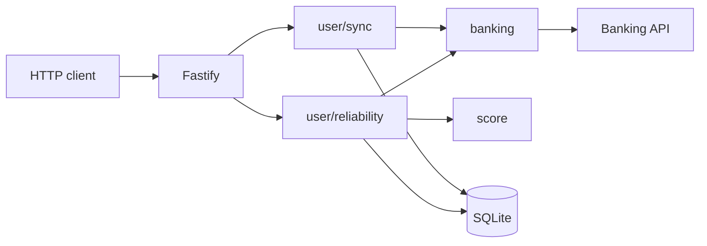
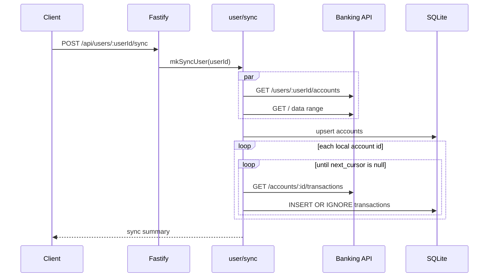
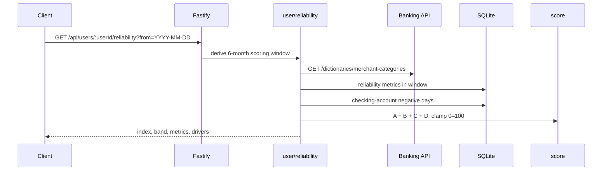

# Thin-File Credit Builder

A single Node.js service that syncs bank accounts from the provided Banking API and computes an explainable Reliability Index (0–100) for thin-file users.

Stack: TypeScript, Fastify, SQLite (`better-sqlite3`). No ML.

## Setup and run

Needs Node.js 22+.

```bash
npm install
npm run db:init
npm run dev
```

The service listens on `http://localhost:3000`. `db:init` creates `data/thin-file-credit-builder.sqlite` and applies `db/init.sql`. The process expects that file to already exist; it does not create the schema on startup.

Optional env (see `.env.example`):

| Variable | Default |
| --- | --- |
| `PORT` | `3000` |
| `DATABASE_PATH` | `./data/thin-file-credit-builder.sqlite` |
| `BANKING_API_BASE_URL` | `https://btq03nn21b.execute-api.eu-central-1.amazonaws.com/` |
| `BANKING_API_KEY` | `development` |

Defaults are enough for the assignment API. Export the variables yourself if you override them; the process does not load `.env`.

```bash
npm test
```

## Endpoints

Discover users from the Banking API first if you need IDs other than `user_1001`:

```bash
curl "https://btq03nn21b.execute-api.eu-central-1.amazonaws.com/"
```

### Sync

```bash
curl -X POST http://localhost:3000/api/users/user_1001/sync
```

Pulls every account for the user, paginates transactions over the Banking API data range, upserts accounts, and inserts transactions by id (`ON CONFLICT DO NOTHING`). A second sync reports the same rows as duplicates.

```json
{
  "user_id": "user_1001",
  "synced_accounts": 2,
  "new_transactions": 631,
  "duplicate_transactions": 0,
  "synced_from": "2025-09-01"
}
```

### Reliability index

```bash
curl "http://localhost:3000/api/users/user_1001/reliability?from=2026-02-20"
```

`from` is required and must be `YYYY-MM-DD`. The scoring window is the 6 calendar months ending on that date, inclusive: `from=2026-02-20` → `2025-09-01` to `2026-02-20`. Scoring reads local SQLite data plus the live merchant-category dictionary.

```json
{
  "user_id": "user_1001",
  "from": "2026-02-20",
  "currency": "EUR",
  "reliability_index": 64,
  "score_band": "MEDIUM",
  "metrics": {
    "income_regularity": 0.83,
    "income_coverage_ratio": 1.41,
    "essential_payments_consistency": 0.89,
    "good_months": 4,
    "negative_balance_days": 54,
    "late_fee_events": 1
  },
  "drivers": [
    "Income present in 5/6 months",
    "Income covers essential expenses (1.41x)",
    "Savings activity in 4/6 months"
  ]
}
```

Bands: LOW 0–49, MEDIUM 50–74, HIGH 75–100.

## Diagrams

### Architecture



Sync writes accounts and transactions. Reliability reads those rows, asks the Banking API for merchant categories, then maps facts through the scoring functions. The HTTP layer stays thin: `src/app.ts` wires the two use cases.

### Sync sequence



### Reliability sequence



## Scoring

Final score = `clamp(A + B + C + D, 0, 100)`.

Amounts are stored as integer cents. Category groups come from the Banking API dictionary at request time (`income`, `essential`, `savings`, `fees`, `high_risk`).

**A. Income regularity (0–25).** `round((months with income / 6) × 25)`. A month has income if at least one in-window transaction is a credit or an `income` category, excluding `savings`.

**B. Income coverage (0–25).** `total income / total essential expenses`, then `round(clamp(ratio / 2, 0, 1) × 25)`. 2× coverage is a full 25 points; anything above that stays at 25. No income or no essential spend scores 0. A missing denominator is not infinite coverage.

**C. Essential payments consistency (0–25).** `round((essential category-months / (6 × essential category count)) × 25)`. A category-month counts when that essential MCC appears at least once in the month. The denominator uses every essential code in the dictionary, including unused ones. An empty dictionary scores 0.

**D. Resilience (−20 to +25).**

| Signal | Mapping |
| --- | --- |
| Savings | `round((months with a positive savings txn / 6) × 25)` |
| Negative balance | `−min(checking account-days below 0, 10)` |
| Late fees | `−min(fee-category transaction count, 5)` |
| High-risk spend | `−round((high-risk debit / spending debit) × 5)` |

Negative-balance days are reconstructed per checking account from the stored closing balance, walking end-of-day balances backward through the window, then summed. That is account-days, not unique calendar days. Savings transfers are excluded from spending and from income. High-risk with no spending is 0.

Drivers always mention income months, coverage, and savings months. Negative-balance days, late fees, and high-risk share of spend are appended when they fire.

## Assumptions and trade-offs

- One process, one SQLite file, EUR only. Fine for the timebox; not a multi-tenant production store.
- Sync is on-demand and full-range. Every call refetches the Banking API `data_range`, not "new since last sync". Duplicate handling is transaction id only, so an edited Banking API row will not update locally.
- Account pages for a user are fetched in parallel. If one account fails mid-pagination, earlier accounts may already be committed. There is no sync job table or rollback.
- Merchant categories are fetched at score time, not stored. A dictionary change can move a score without a new sync.
- Closing `balance_cents` is whatever the last account upsert wrote. If that snapshot does not match the last in-window transaction, reconstructed negative days drift.
- Reliability does not require a prior successful sync; a never-synced user scores as empty history (usually LOW / 0).
- `from` is a required query param. Missing or malformed dates return 400.

## Scoring limitations and bias

This is a rules engine over MCC labels. It will punish people whose money does not look like a salaried checking account.

- Irregular pay (gig, seasonal, cash) loses regularity points even when annual income is fine.
- Shared or family-paid rent/utilities look like missing essentials.
- Income includes generic credits, so refunds and transfers can inflate coverage. Income-category debits reduce the income total.
- Essential credits (refunds) shrink essential spend and can inflate coverage.
- Savings is "any positive savings-category month", not an amount. €1 and €1,000 look the same.
- High-risk is whatever the dictionary calls `high_risk`. That can encode lifestyle judgments (gambling, crypto, etc.) that are not credit risk.
- Negative-balance account-days double-count a day that is negative on two checking accounts.
- Six months is short. One bad month is a large slice of the score.
- The 2× coverage cap is a guess. It stops a tiny expense base from dominating the score, but it also treats "comfortable" and "very high surplus" as identical.

I would not use this number as a lending decision without a documented model version, a replay of inputs, and a fairness review on the MCC mapping.

## Discussion notes

These are not implemented. They are how I would take the current design further.

**API design.** Put `/api/v1/` on the HTTP surface. Keep response field names stable; add new metric keys instead of renaming. Ship `model_version` next to `reliability_index` so a mapping change is visible to consumers. If a signal's meaning changes, add `income_coverage_ratio_v2` rather than silently redefining the existing field.

**Data ownership.** The Banking API owns raw transactions and the MCC dictionary. This service owns the synced snapshot, derived facts, and the score. The client should not recompute the index. Normalization (cents, EUR, ISO dates) belongs here because scoring depends on it. I would persist the dictionary version used for a score so we are not scoring yesterday's transactions with today's labels without noticing.

**Consistency.** Idempotency today is `INSERT OR IGNORE` on transaction id. I would add a `sync_runs` row with status, and treat a run as failed unless every account finished. Drift check: compare local count and max(date) per account with the Banking API. Out-of-order transactions are OK for scoring (we filter by date); they are not OK for balance reconstruction if the closing balance is stale.

**Scalability.** The request-path scan of transactions is the first wall. For 100k users I would move sync to a worker, store monthly aggregates, and score from those. SQLite stays until write contention shows up, then Postgres. Merchant categories are a small, cacheable read.

**Sync strategy.** Next step after on-demand: store `synced_through` per account and request `from` that date. Webhooks from the Banking API would enqueue an incremental sync, not recompute the score inline. Scheduled catch-up still needed for missed events.

**Caching.** Cache the MCC dictionary (short TTL). Cache `(user_id, from, tx_watermark, dictionary_version) → score`. Invalidate the watermark on sync. I would not cache raw transactions in memory; SQLite is already the cache of the Banking API.

**Explainability.** Drivers are analyst copy, not an audit log. Persist the model version, the metric vector, and the point breakdown. Then a later mapping change can replay "what would this user have scored yesterday".

**Bias.** Measure score gaps by proxies we actually have (income regularity, cash vs card, presence of essential MCCs). MCC `high_risk` needs a review: is this default risk or moralizing spend? A thin file with rent paid in cash will look worse than a thin file with rent on a card. That is a product decision, not a math accident.

**Incidents.** Log Banking API status, sync duration, rows inserted, and the four point components. If scores jump, first check dictionary drift and whether sync is partial. Replay a user through the stored transactions with a pinned model version before blaming the Banking API.

## AI usage

Cursor was used throughout: scaffolding the Fastify/SQLite service, Banking API client, scoring split, tests, and this README. I specified the coverage cap, resilience mappings, and the package layout, then reviewed the generated SQL and HTTP wiring. The assignment allows AI; the scoring choices and trade-offs above are the parts I would defend in discussion.
