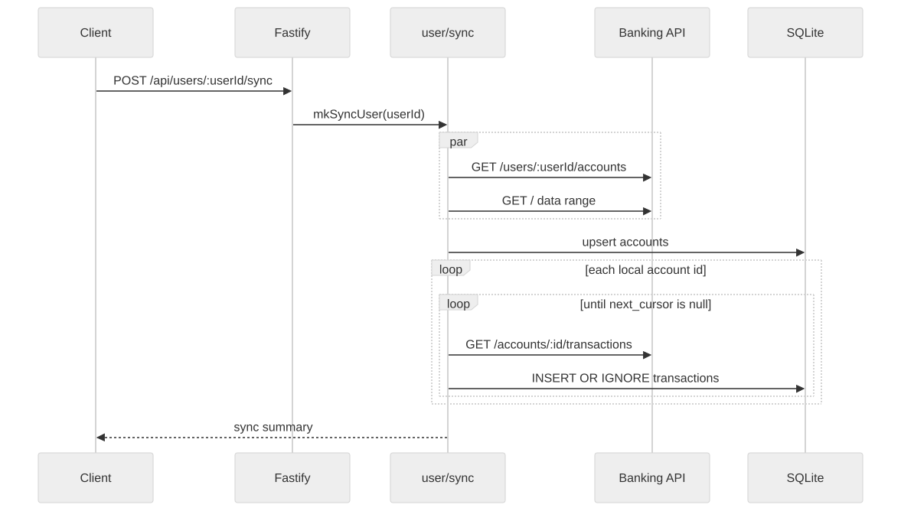
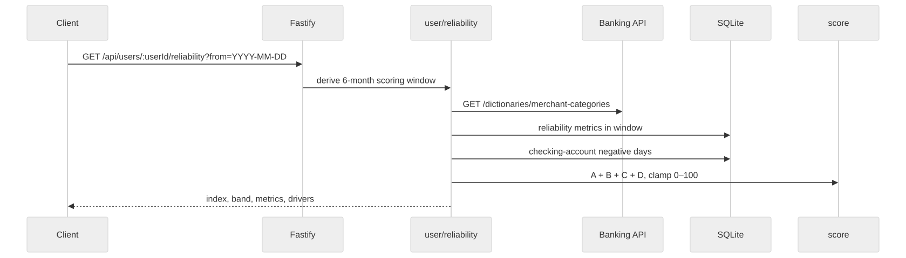

# Thin-File Credit Builder

Syncs the Banking API into SQLite and scores a Reliability Index (0–100)

## Tech stack

- **Runtime:** Node.js 22+
- **Language:** TypeScript
- **HTTP:** Fastify
- **DB:** SQLite via `better-sqlite3`

## Setup

```bash
npm install
npm run db:init
npm run dev
```

Listens on `http://localhost:3000`. Schema is applied only by `db:init`; the process does not create it. Defaults match the assignment API (`.env.example`). The process does not load `.env`. `npm test` runs the suite.

## Docker

```bash
docker compose up --build
```

Wait until the `app` service is healthy, then in another terminal:

```bash
curl -X POST http://localhost:3000/api/users/user_1001/sync
curl "http://localhost:3000/api/users/user_1001/reliability?from=2026-02-20"
```

The image applies the SQLite schema on start. SQLite is kept in a named volume (`credit-builder-data`), so a later `docker compose up` reuses synced data.

Without Compose:

```bash
docker build -t thin-file-credit-builder .
docker run --rm -p 3000:3000 thin-file-credit-builder
```

## Endpoints

- Sync User
- User Reliability Index

Example user: `user_1001`. For other user IDs: `curl` the Banking API `/`.

```bash
curl -X POST http://localhost:3000/api/users/user_1001/sync
curl "http://localhost:3000/api/users/user_1001/reliability?from=2026-02-20"
```

`from` is required (`YYYY-MM-DD`). Window is the 6 calendar months ending on that date, inclusive.

## Diagrams

Sources: `docs/diagrams/*.mmd`. Regenerate: `npm run docs:diagrams`.








## Assumptions

- **Negative balance days are anchored to the account's current balance, not to the scoring window's end date.** Daily balances are reconstructed backwards from `balance_cents` — the account's balance *right now* — through the transactions in range. That's only accurate when `from` is today, or very close to it. For a `from` further in the past, any transactions that happened between the window's `endDate` and now will shift every reconstructed daily balance by the same amount, so `negative_balance_days` for a historical query can be meaningfully wrong. Fixing this properly needs either a balance-as-of-date from the Banking API, or our own daily balance snapshots taken on every sync.
- **`good_months` is read as "months with savings activity."** The assignment's example response includes a `good_months` field with no definition in the scoring model itself. We reuse the same month-count that drives the savings resilience signal — a `savings`-category transaction present in that month. An equally valid reading would combine income presence, essential-payment consistency, and no negative-balance days into one composite "good month"; worth confirming with whoever reads this field before it ships.
- **The merchant category dictionary is a single shared local snapshot, refreshed on every `/sync`**, not fetched live when scoring. Any user's sync overwrites the whole stored dictionary with whatever the Banking API returns at that moment, and scoring always reads that shared local copy. This keeps scoring off the network and stable between syncs, but it is not a per-user or per-score snapshot: if the Banking API changes a category's group, the very next sync — by any user — updates what every user's subsequent score is computed against. Making it fully reproducible per score would mean versioning the dictionary and recording which version a given score used (see Discussion → Ownership).

## Scoring limitations and bias

Rules over MCC labels. Irregular or cash income looks worse than a salaried card trail. Shared rent looks like missing essentials. Generic credits can inflate coverage. Savings is presence, not amount. `high_risk` can encode lifestyle, not default risk. Two checking accounts can double-count a negative day. Six months makes one bad month large. The 2× coverage cap treats “comfortable” and “very high surplus” the same.

Not a lending decision without a model version, input replay, and a fairness review of the MCC map.

## Discussion

Not implemented beyond what's noted below. How I would take it further:

- **API.** `/api/v1/`. Version the API so scoring fields and calculations can change without breaking existing consumers — new signals are additive fields; a field whose meaning changes gets a new name or a new version, not a silent redefinition.
- **Ownership.** The Banking API owns raw transactions and merchant categorization. This service owns a local copy of the merchant category dictionary (refreshed on sync) plus all derived facts and the score itself. Today that copy is a single shared snapshot, so it's insulated from a live Banking API call per request but not from dictionary drift between syncs. The next step is a *versioned* dictionary — keep every historical version, and record which version each computed score used — so a score is reproducible even after the dictionary changes again. The frontend should own presentation only.
- **Consistency.** Add a concept of a `sync run` that records the result of each sync: success or failure, and which transactions were synced under it, so a run can be traced and resumed from its last synced transaction.
- **Scale.** Migrate to Postgres for scalability. The merchant category dictionary is a small, cacheable read. Watch SQL query performance and add indexes where needed. Move historical data to a data warehouse and take advantage of warehouse-speed aggregation.
- **Sync.** Today `/sync` always re-pulls the full available history — simple, but wasteful, and only usable on demand. The natural next step is incremental sync: store the last-synced cursor or timestamp per account and only request transactions after it. If the Banking API supports webhooks, move to event-driven sync (webhook → enqueue → sync just that account) instead of polling; without webhooks, a scheduled per-user job on a cadence (e.g. daily) covers most freshness needs without a full resync.
- **Cache.** Cache the reliability response, keyed on the inputs that actually determine it (user, `from`, and what's been synced), and invalidate it whenever `/sync` inserts new transactions or refreshes the merchant category snapshot for that user.
- **Explainability.** Persist all variables, metrics, and point values used in a calculation so yesterday's score can be replayed exactly, even after the scoring model or dictionary changes later.
- **Bias.** Measure gaps by income regularity, cash vs. card, and presence of essential-category spending. Review whether `high_risk` measures default risk or just moralizes lifestyle spend.
- **Incidents.** Log Banking API status, sync duration, and rows inserted per sync. For a sudden score jump, check merchant category dictionary drift and sync failures first.

## AI usage

Cursor was used for scaffolding, pairing and tests
